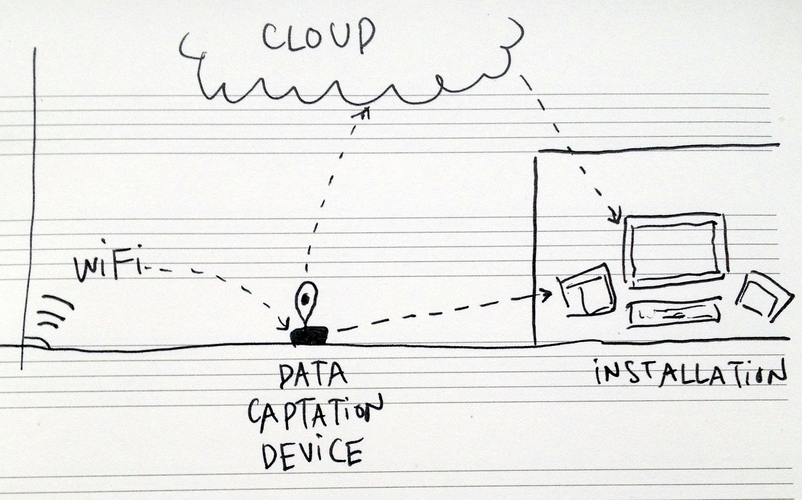
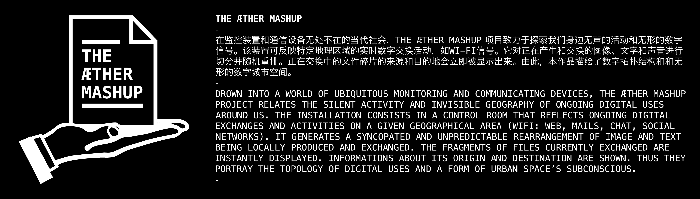

Aether Mashup is an interactive installation that explores ongoing digital exchanges and activities on a given geographical area. During a one-month residency program in the art village of Caochangdi (near Beijing),

we created a portable device that turns wifi conversations into streams of images and sounds within a specific perimeter.

The project was produced at RAWR! in Caochangdi during the [Beijing Design Week](http://www.bjdw.org/). shown at the GeoCities-Smart Cities Biennale at the [Chinese Museum of Digital Art](http://www.modachina.org/) and in the Make+ show at [V-Art Center](http://vartcenter.com ) in Shanghai.

  <iframe src="//player.vimeo.com/video/92498574?byline=0&amp;portrait=0" width="100%" height="580" frameborder="0" webkitallowfullscreen mozallowfullscreen allowfullscreen></iframe>

By [Clément Renaud](http://clementrenaud.com), [Nicolas Maigret](http://peripheriques.free.fr) and [Lionel Radisson](http://makio135.com).  
With the support of [Make+](http://makeplus.org), [Caochangdi (CCD – The Community)](http://caochangdi.org/), [Fabricatorz](http://fabricatorz.com/) and [Institut Français](http://www.institutfrancais-chine.com/).
