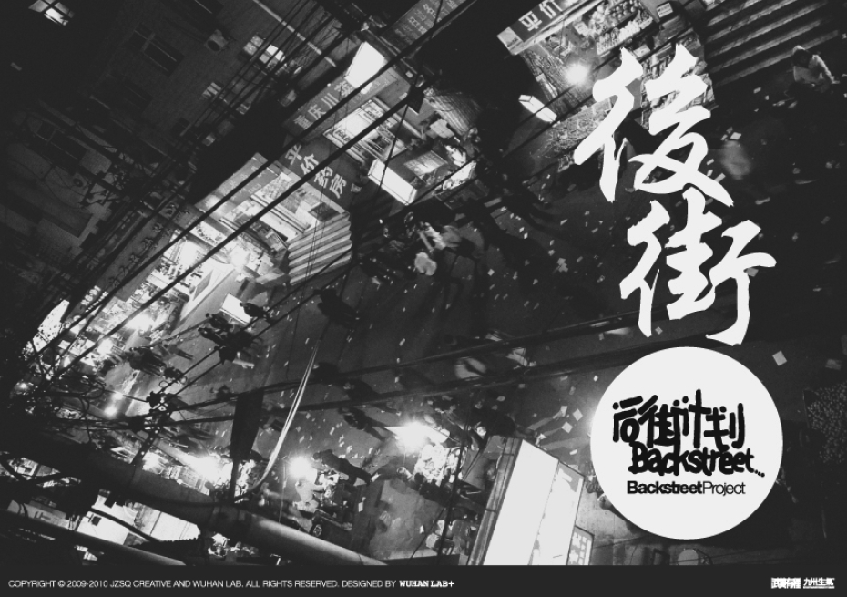
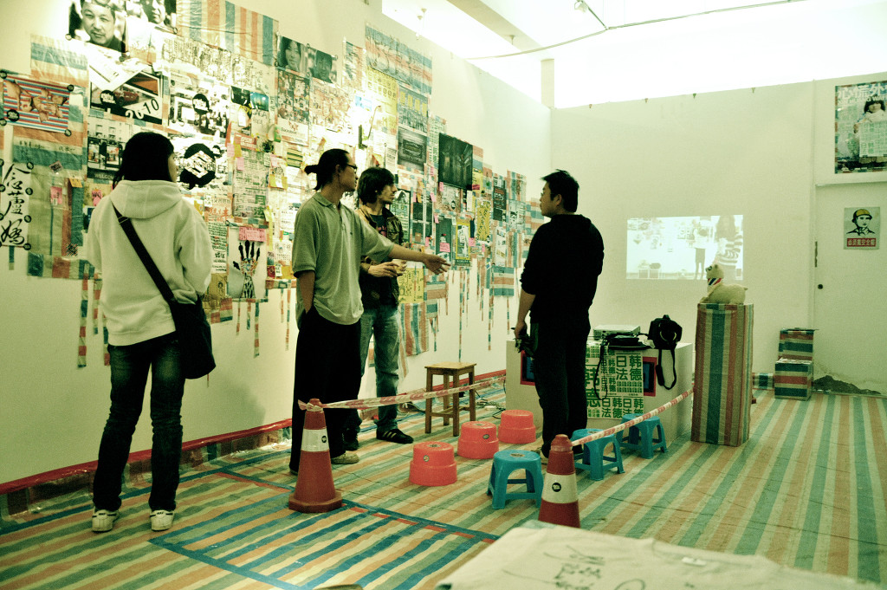

The [Backstreet project (后街计划)](http://www.jzsqcrew.com/bjdw2012/) records moments of urban wildness by documenting the ecosystem of the Wuchang district  “backstreets” in  Wuhan, China.

The growing population and the incredible pace of urbanisation in China has led to the appearance of unique sort of spaces within the interstices of the new buildings. The universities in Wuhan have been surrounded by narrow streets known as  “backstreets” (后街) where students met, go out, share meals and have fun.

Designers, video and multimedia artists took those streets as their playground to lead  graphic research and experimentations and  record the last moments of those streets. As today, all Wuhan backstreets have been destroyed.

This project was shown in [Beijing Design Week 2012](http://issuu.com/5431682/docs/2012-bjdw)
