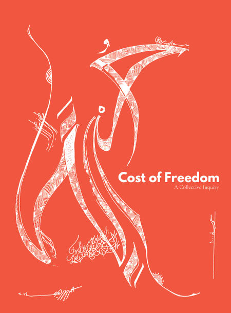

The book was released on Monday, November 9 2015 under a CC0 license on costoffreedom.cc.

44 contributors, including 12 on-site book sprinters, wrote, compiled, and edited more than 50 original contributions, including paintings, poems, personal reflections, critical observations, polemical pieces, theoretical treatises and calls for action about moving within and living with free culture and all its complexities, as well as personal texts about Bassel Khartabil.

It was written during a Book Sprint from November 2nd to 6th 2015 on the “Cost of Freedom” as part of the #FREEBASSEL campaign, and launched at Re:Publica 17 - read the [article on Global Voices](https://globalvoices.org/2017/06/05/artists-and-writers-celebrate-the-work-of-missing-syrian-developer-bassel-safadi/) and the  [report](https://www.booksprints.net/book/cost-of-freedom-book-to-be-released/) on Book Sprints website.

> This book is born in an attempt to free Bassel Khartabil Sadafi, loved and celebrated Internet volunteer detained in Syria since March 15, 2012. His name has been deleted from the Adra Prison’s register where he was detained, on October 3, 2015.  We have not received any information about his current status or whereabouts since. The introductory part of this book called Collective Memories gives voice to his friends and family that have been urging for his release and want him back to his normal life and freedom, immediately.

From the *Introduction* of the [Cost of Freedom](http://costoffreedom.cc/) book.

## PRESS RELEASE

> San Francisco — Sunday, 22 May 2016 — Cost of Freedom: A Collective Inquiry is a book demanding freedom for Bassel Khartabil and introspect the costs of participation in free knowledge movements. The book was written in Pourrières, France from November 2nd to 6th, 2015, with contributions from 45 free knowledge activists around the world, including Creative Commons founder and former U.S. presidential candidate Lawrence Lessig and Khartabil’s spouse, Noura Ghazi Safadi, and uncle, Faraj Rifait.

> Today the book is available in electronic and print formats for reading, downloading, sharing, and purchase at http://costoffreedom.cc. The entire book is dedicated to the public domain with the “CC Zero” license (CC0-1.0).

> Bassel Khartabil is a free knowledge and human rights activist who has been detained in Syria since 15 March 2012, and missing since 3 October 2015. A global #FREEBASSEL movement ranging from Amnesty International to the Wikimedia Foundation has steadfastly called for Khartabil’s release.

> Cost of Freedom builds its case for the cost and value of free and open knowledge through essays on the pains and relevance of free culture in the real world and personal reflections on the life, contributions, and costs paid by Khartabil.

> #NEWPALMYRA Director Barry Threw said, “Bassel has dedicated his life toward advancing freedom for the people of Syria and the world. This book contains vital perspectives from thought leaders and activists on the price we pay to secure freedom for all. “
