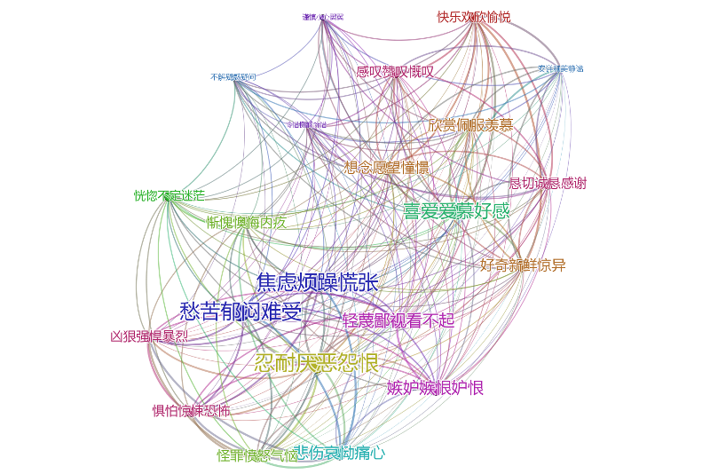
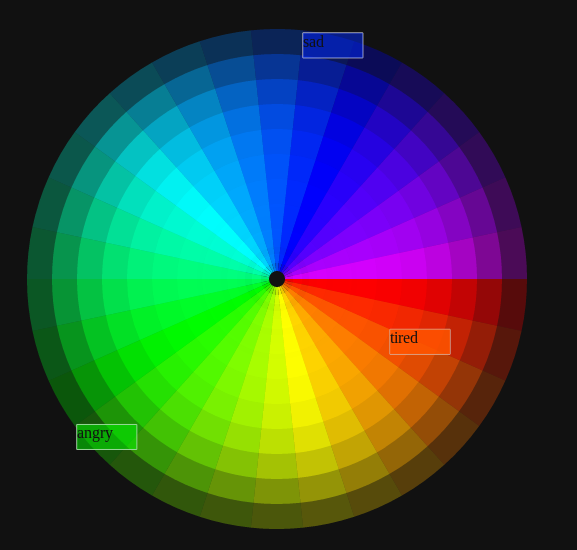

## Emotional China

Emotional China is a platform that extract, store and classify emotions from tweets in Chinese language.

It extracts all words expressing sentiments from Sina Weibo and classify them,. We try to sort them into groups, with colours, forms, etc to provide a working algorithm and classified corpus for Sentiment Analysis in Chinese language using Bayesian probabilities.

* [Code on Github](https://github.com/clemsos/feeling-wheel)
