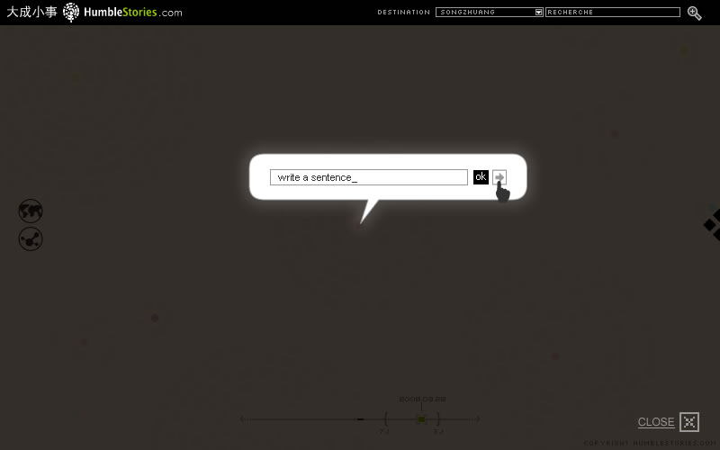
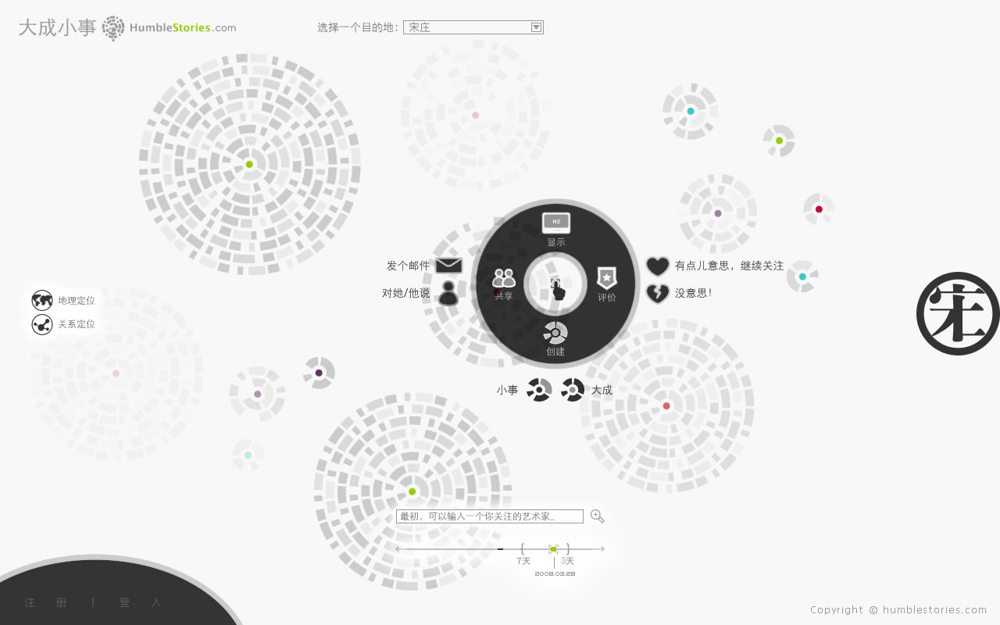
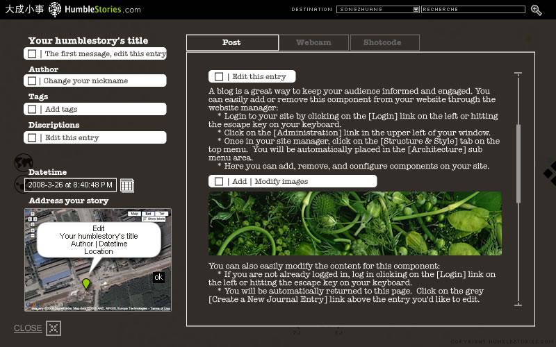

Humble Stories was an attempt to understand better small facts and feelings that make people’s everyday life in remote urban areas. Created during the Spring 2008, Humbles Stories collected pictures, sounds and words from different locations of the suburbian art village of Songzhuang (宋庄) near Beijing, China.

Standing somewhere between a social network, a geo-localization tool and an experimental art piece, Humble Stories uses Qr Barcodes and mobile phones to visualize how new dimensions of spaces can be mediated and explored through code.

The project was created with the support of Paris 8 University (France), the LEDEN lab research (France), the Beijing Graphic Institute (China) and the municipality of Songzhuang.

