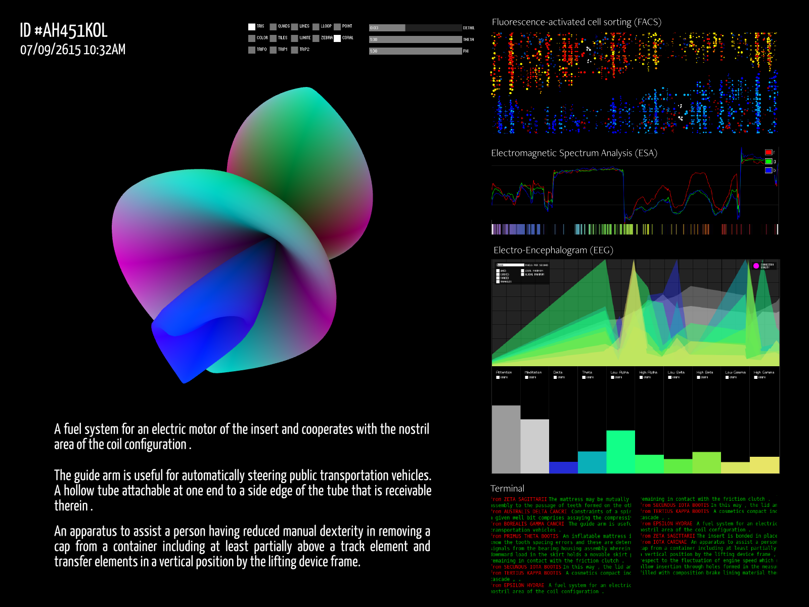
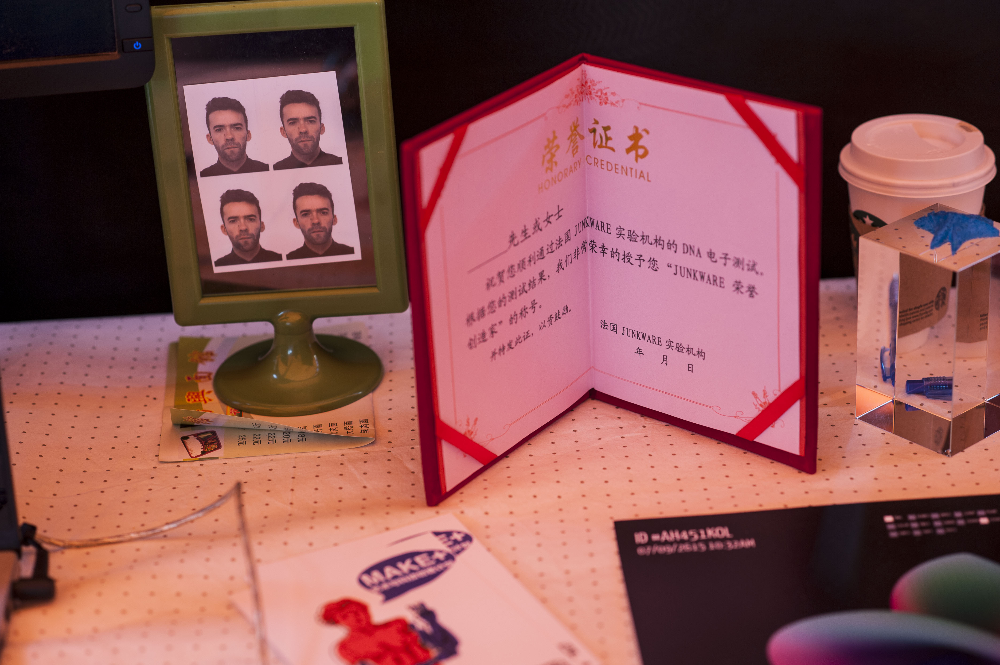
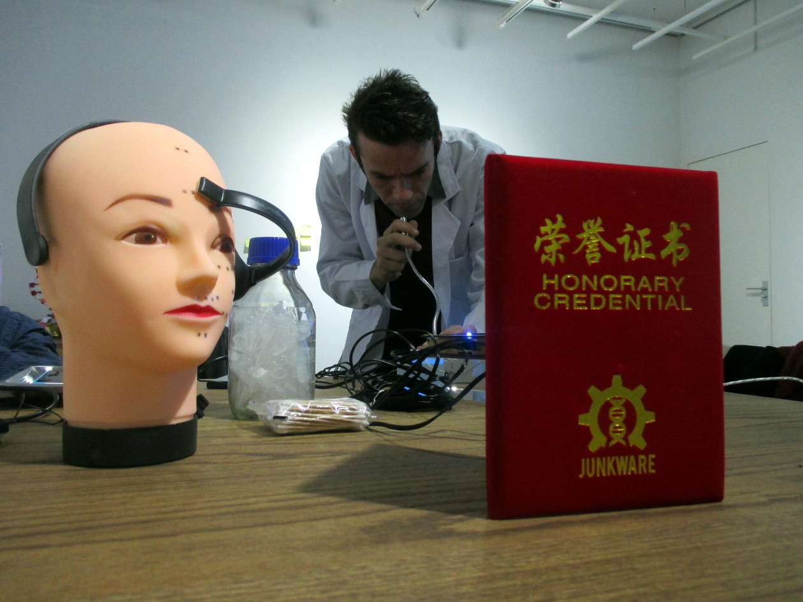
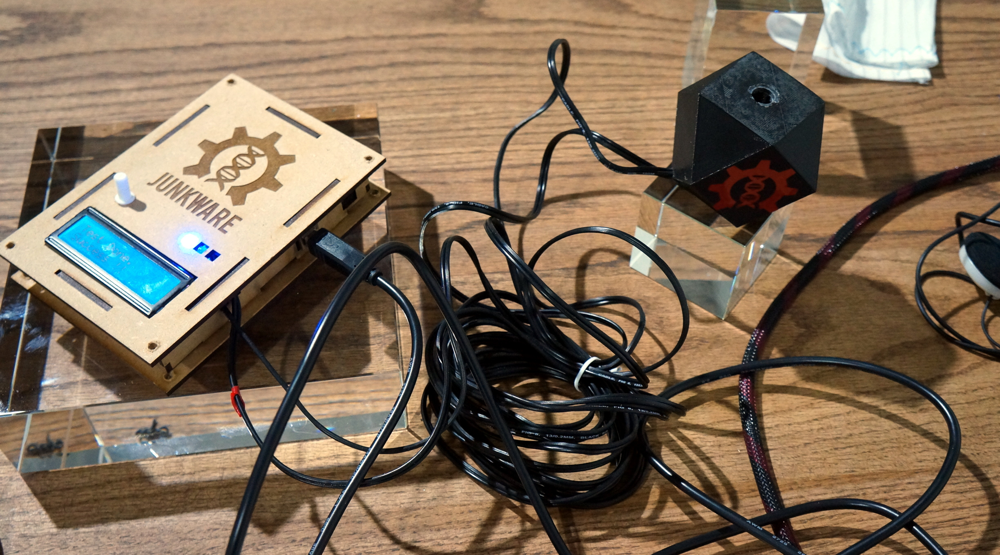

>*"We are the eternal return of the enslaved stock under its new name, junkware.*  
>*We are the medium, the message and the code.*  
>*We are worth our code, not worth a rush."*  
> Excerpt from the book *[Junkware](http://books.google.fr/books?id=7hZDllG70OYC&lpg=PP1&hl=fr&pg=PA9#v=onepage&q&f=true)* by T. Bardini, 2011

*Junkware* is a digital installation that offers a grotesque representation of
current innovation processes. We created a speculative machine that recycle existing patents data into physcial and textual descriptions of futuristic objects, based on inputs of biometrics information from the audience.

Each participant from the audience get a *"Junk Certificate"* that contains all information about the fictional object he generated with its own biometric data.

The Junkware Machine is introduced to the audience as a groundbreaking technology
by a fictional scientific team lead by the character Pr. Roger Lafleche.

This mobile lab invite the audience to reflect on the impact of their fascination for science and technology, and the discourses about innovation.

Created in November 2014 in Shanghai, China

By [Clément Renaud](http://clementrenaud.com), [Catherine Lenoble](http://literaturing.net), [Julien Maudet](http://dcalk.org) and [Qu Hongyuan](http://quhongyuan.org).  
A co-production [Make+](http://makeplus.org) and [Crossed Lab](http://www.crossedlab.org)  
With the support of the Mecene Comitee of the 50th Anniversary of French-China Diplomatic Relationships, the French Institute, the French Centre National du Cinéma (CNC) and the Rhône-Alpes région.

Read the whole story on the official [website](http://junkware.io) and the [catalog](http://junkware.io/uploads/thejunkventurebook.pdf) of the installation. The code is also available on [Github](http://github.com/clemsos/junkware)

