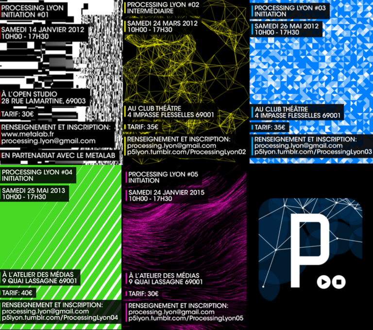

*Le Club* is a collective initiative to play, experiment with code, words, maps and images. Based in Lyon (France), we deliver creative coding workshops and support different art and installation projects.

<iframe src="./demo.html" allowFullScreen="true" quality="high" width="100%" height="550px" align="middle" allowScriptAccess="always" frameborder="0"></iframe>

 
We also host the local chapter of the [Processing](http://processing.org) community and works with Open Frameworks, d3.js, Arduino, Python and any cool tech we can get our hands on. Join us on [Github](http://github.com/leclub), [Twitter](http://twitter.com/__leclub) or on our [website](http://leclub.github.io/).

