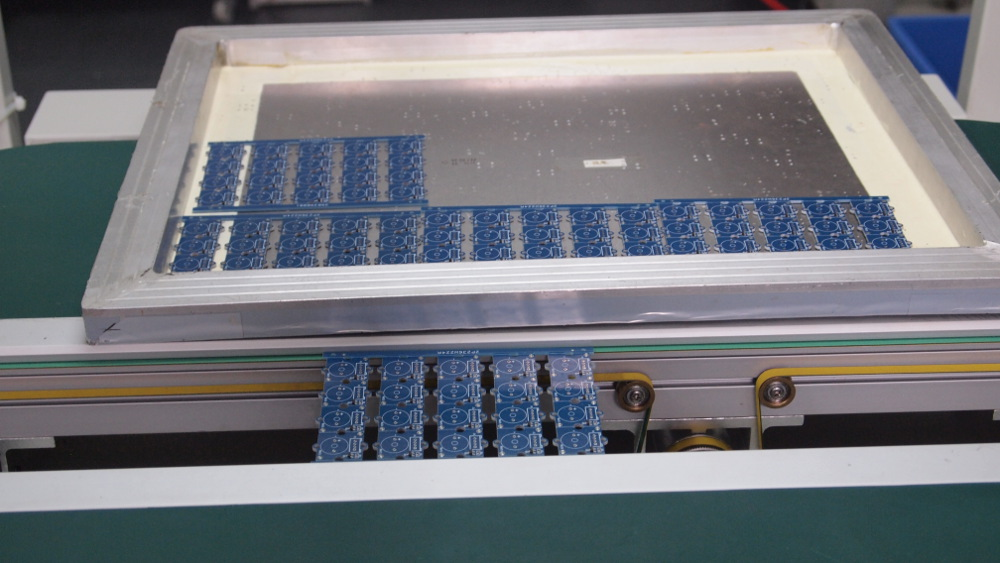
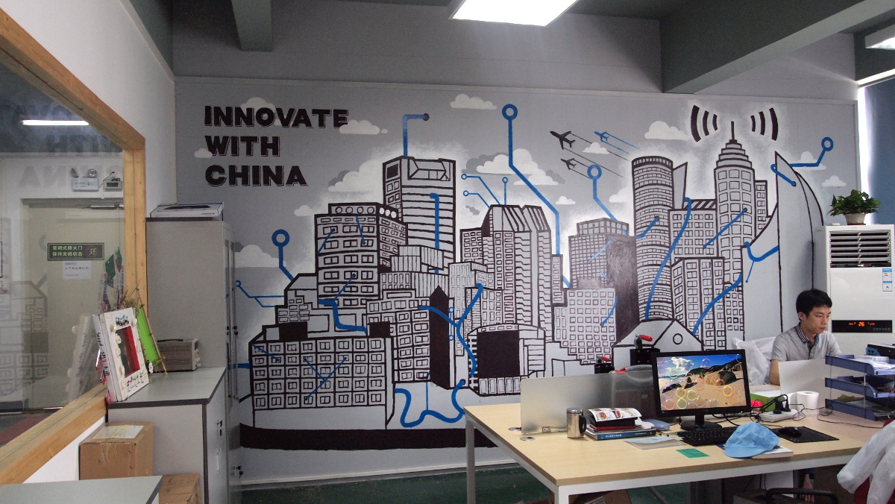

Open Innovation Models in Urban China (OPIMPUC) was an academic research project that studies the emergence of new urban places dedicated to technologies (hackerspaces, coworking spaces, fablabs, etc.) in the context of China's urban and industrial transformation.

More specifically, this project aimed at providing insights on the role of practice inherited from the open-source communities, and their relationships with the Chinese traditional manufacturing sector, including the *shanzhai* conterfeiting industry. Fieldwork was held in Shanghai, Shenzhen, Hong-Kong and Nanjing. The project lead to several scientific publications and conferences, as well as reports in newspapers and magazines.

Funded by the French National Agency under the Innovative Societies program. Read the [official announcement](http://www.agence-nationale-recherche.fr/en/anr-funded-project/?tx_lwmsuivibilan_pi2%5BCODE%5D=ANR-13-SOIN-0006)

Read the research reports (pre-print):

* Renaud, C., Puel, G., & Fernandez, V. (2016). [On the open innovation paradigm: from outsourcing to open-sourcing, The making of innovation in Shenzhen](/uploads/papers/ShenzhenEurolio-EN-final.pdf). In GeoInnov2016. Toulouse: *EUROLIO*
* Renaud, C., Puel, G., & Fernandez, V. (2016). [Changing the Culture of Innovation in Shanghai: Open Innovation Spaces](/uploads/papers/Innovation-Spaces-Shanghai-EN-ReluCR.pdf). In GeoInnov2016. Toulouse: *EUROLIO*.
* Renaud, C. & Orozsco, L. (2016). [Open innovation, closed business: Grassroots innovation process and places in China](). In GeoInnov2016. Toulouse: *EUROLIO*.



### ACADEMICS PARTNERS

* LEREPS Laboratoire d’Etude et de Recherche sur l’Economie, les Politiques et les Systèmes sociaux at Toulouse 2 University, France
* DPUD Department of Urban Planning and Design, Nanjing University, China
* TPT Telecom ParisTech, Social Sciences and Economics (SES), France

