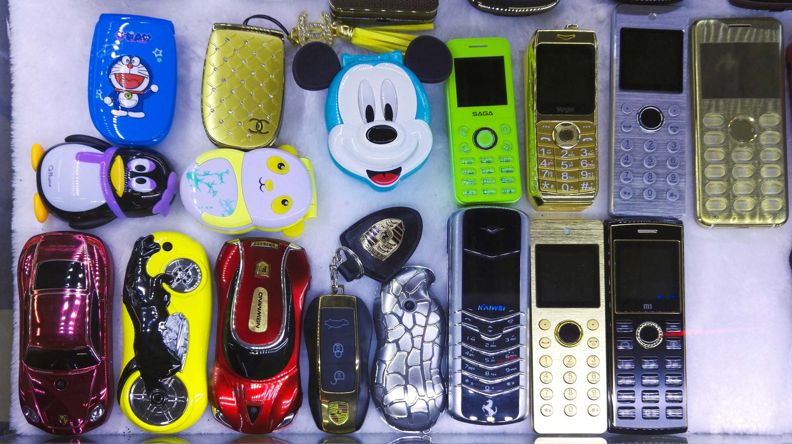
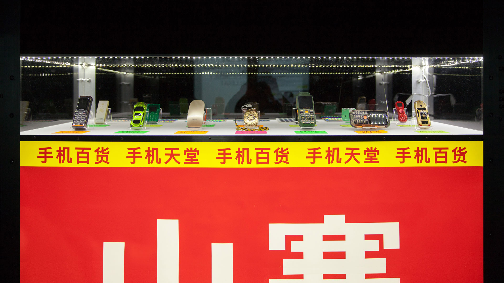
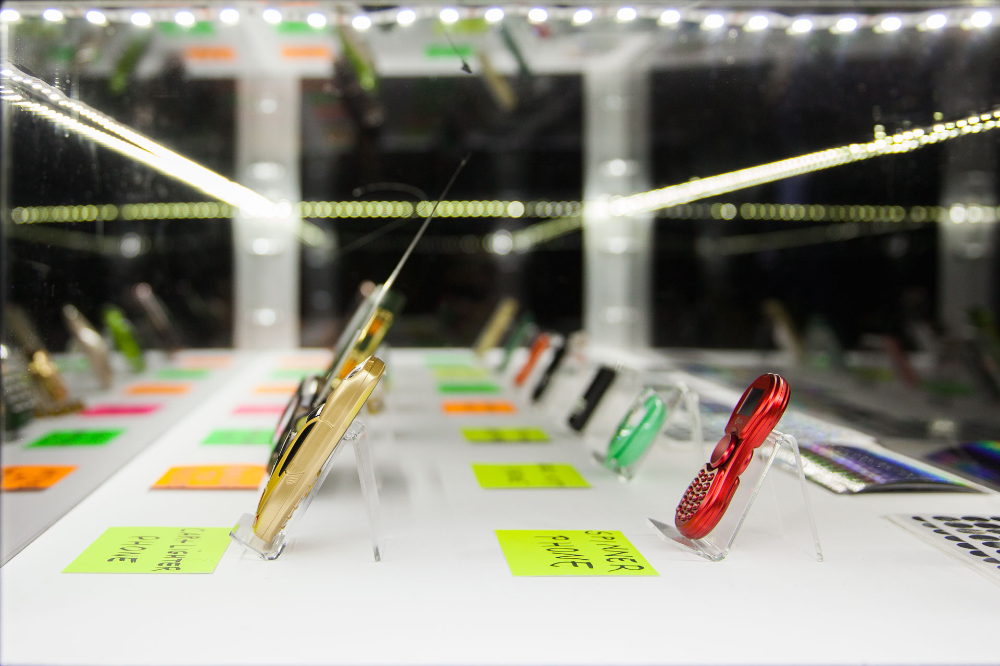
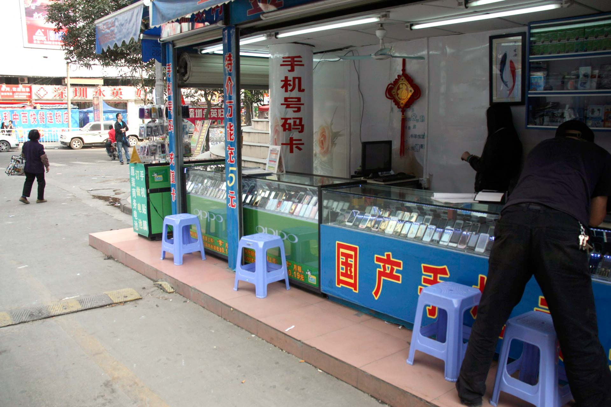

Shanzhai Archeology is a collection of original phones from the technological interbreeding Made in China. This project casts a critical look at the production of technology through an artistic interpretation of a recent historical fact, still poorly known: the shanzhai.

Often presented as mere counterfeits of low quality, these objects nevertheless draw many unusual technological trajectories that make them the revealers of technological possibilities literally out of European standards. As odd looking hybrids, these puzzling artefacts question a hyper-normalised western technological imaginary.

CONCEPTION: [DISNOVATION.ORG](https://disnovation.org/shanzhai.php), CLÉMENT RENAUD & YUAN QU - 3D MODELS: TERRELL DAVIS

### PRESS RELEASE

> The Chinese term shanzhai (山寨) refers to counterfeit consumer goods. This includes imitation, trademark infringement, parody, lookalikes and improved goods, particularly in the field of electronics. A shanzhai (literally shan: mountain, zhai: stronghold) denotes a remote village in the mountains where bandits had once recreated their own form of society, far from the rules of the emperor.

> Shanzhai Archeology presents an extraordinary collection of mobile phones from this technological interbreeding Made in China. These are hybrid products developed at an incredible speed merging piracy, reverse engineering, unique creativity and self-taught skills.

> In this collection, a Buddha Phone, becomes a virtual altar by pressing a special key. The “smallest in the world” or Prisoner Phone is made of 99% plastic and is barely detectable by the authorities. There’s the Taser Phone, marketed as a self-defense weapon, or the Sound System Phone, catering for China’s pensioners as it can broadcast loud sound outdoors, being heard above the din of the public dances they love. It also comes with several gigabytes of old-fashioned communist songs that Chinese pensioners are particularly keen on. Other curious devices include strawberry or car-shaped phones, devices with in-built electric razors, lighters, power banks, video projectors and other impressive features.

> A profitable business produced by small companies, shanzhai mainly happens out of Western sight, due to regulations that forbid most of these hybrid products to circulate legally across borders. Nevertheless, shanzhai devices fulfil a bespoke need or desire for hundreds of thousands of consumers in countries around the world, not just in China.

> At a time when shanzhai might be under threat – following the Chinese government’s decision to clean up the country of its counterfeiter reputation – this project casts a critical eye at the results of unfettered technological innovation, through the relatively unknown history of the shanzhai.

> Positioning this project at the crossroads between art and anthropology, the artists explore the cultural value of shanzhai and the radical otherness of its creative process; an open manufacturing model resulting in singular design solutions outside streamlined market forces and global innovation myths.

*Irini Papadimitriou, London, January 2018*

## Read more at [disnovation.org](https://disnovation.org/shanzhai.php)
