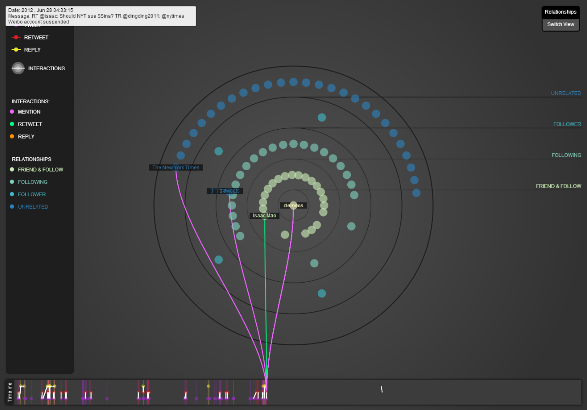
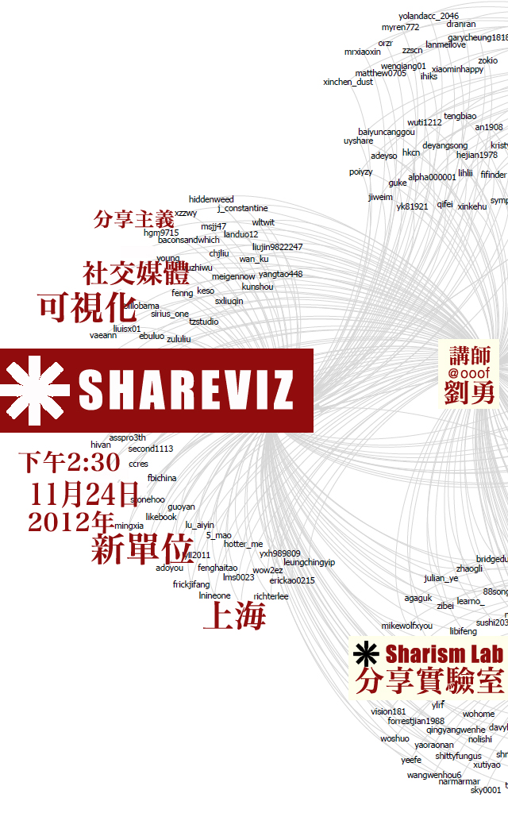
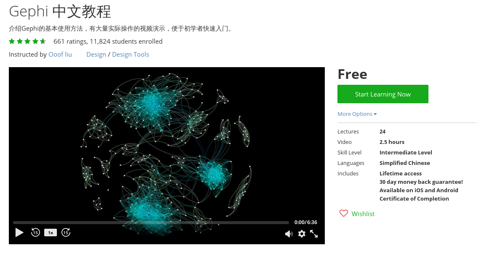
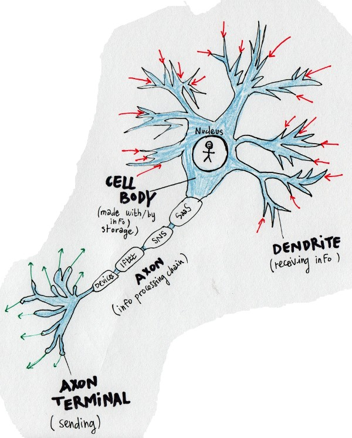
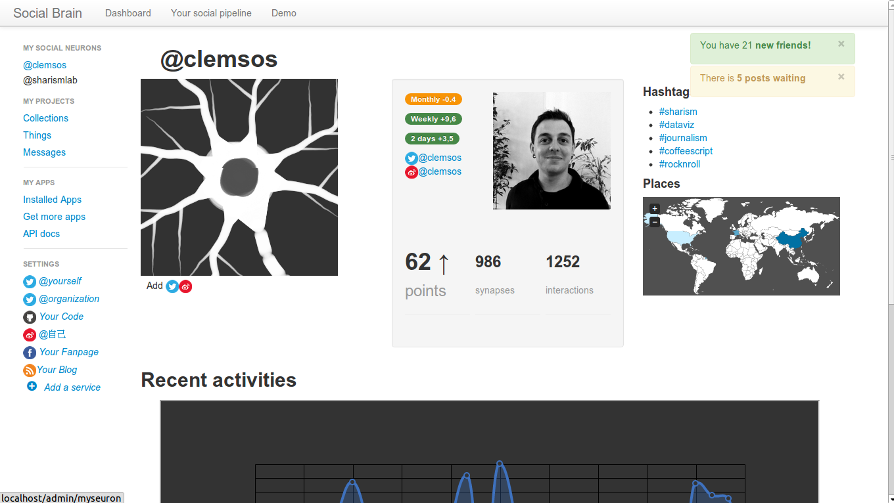
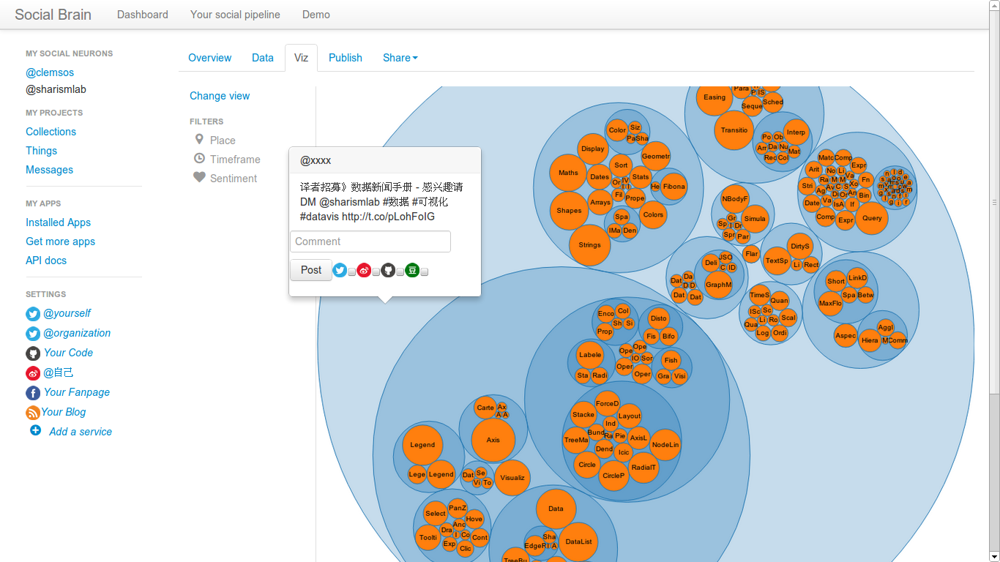

Created in 2012, Sharism Lab gather Chinese bloggers and Internet enthusiasts in China to research the new tools and practices of information sharing. The project was initiated by [Isaac Mao](http://isaacmao.com/) and aimed at investigate existing social activities using data science, art and philosophy.

### Community events and trainings

Sharism Lab's team focused on small experiments, frameworks and training about data visualization and social networks analysis. We organized several gatherings and events for early data visualization enthusiasts to meet.

  

### Gephi MOOC

The [Massively Open Online Course (MOOC) about Gephi](https://www.udemy.com/gephi/) in Chinese was one of the most successful projects. Our team member Liu Yong ([@ooof](http://twitter.com/ooof)) has trained today more then 10 000 people on this software.

### The Social Brain Framework

[Social Brain Framework (SBF)](https://github.com/sharismlab/social-brain-framework) was a toolkit for Social Network Analysis (SNA) based on the analogy of the (human) brain. It borrowed methodologies from neurology, linguistics, psychoanalysis, sociology and computer science to imagine new methods to lead social media analytics.

The new participatory practices of knowledge called "collective intelligence" is created  by very complex sets and subsets of interactions through different networks. To investigate those ongoing phenomenons we use the conceptual analogy of a human brain to provide a schematic representation and description.

Primary entities of this online anatomic body are called social neuron (seuron) forming a large network of billions of human and non-human (animal, things, machines) beings linked with trillions of connections.

