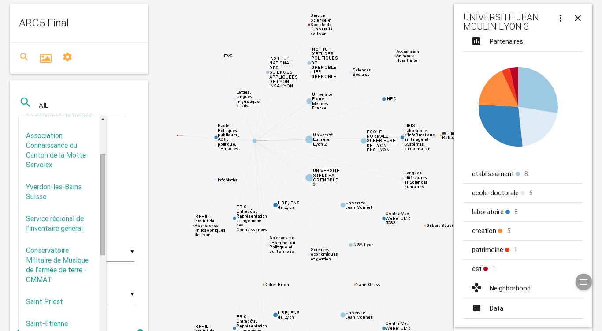
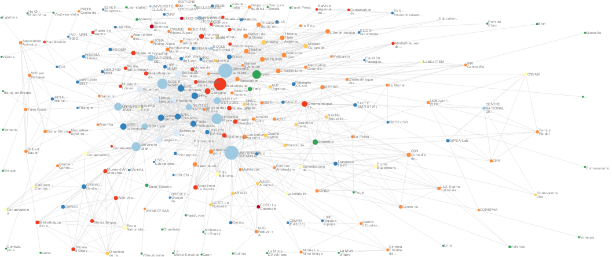

*Topogram* is a web-based and open-source toolkit to explore the way people and/or machines interact. Topogram provides ways to represent and explore their relationships as networks of activities.

The software is divided into 2 parts:

1. a Python mining library and webserver to extract networks of words, citations and places from text data and
2. a collaborative visualization interface to edit, annotate and publish graphs.

### What is it used for ?

People use Topogram to understand organizations and arrangements of places, words, people and things. For instance : What does the French professional network of car manufacturers looks like ? How does startup communities in Myanmar relates to the idea of sustainable development ? What are the keywords that links volunteers of my organization together ?  etc.  

#### Why Topogram ?

It answers the growing need for interactive mapping of complex online and offline interactions. Also because you need to be able to make sense of a bunch of text data without hours of development. Finally, because you may want to own your research environment and still be able to use it in your web browser so you can share results and analysis process easily.

For more details, read the [FAQ](http://topogram.io/faq) on the [official website](http://topogram.io). The code is available on [Github](http://github.com/topogram/topogram).

