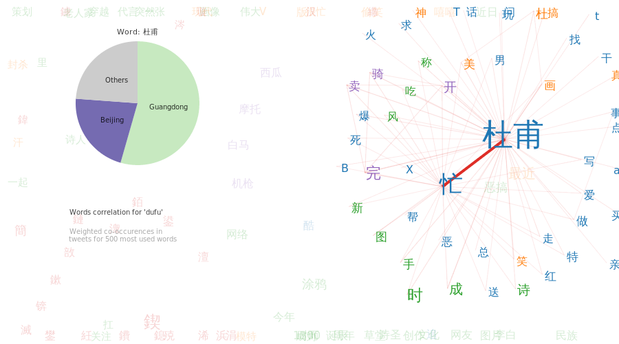
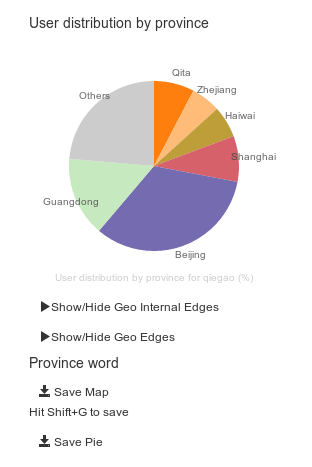
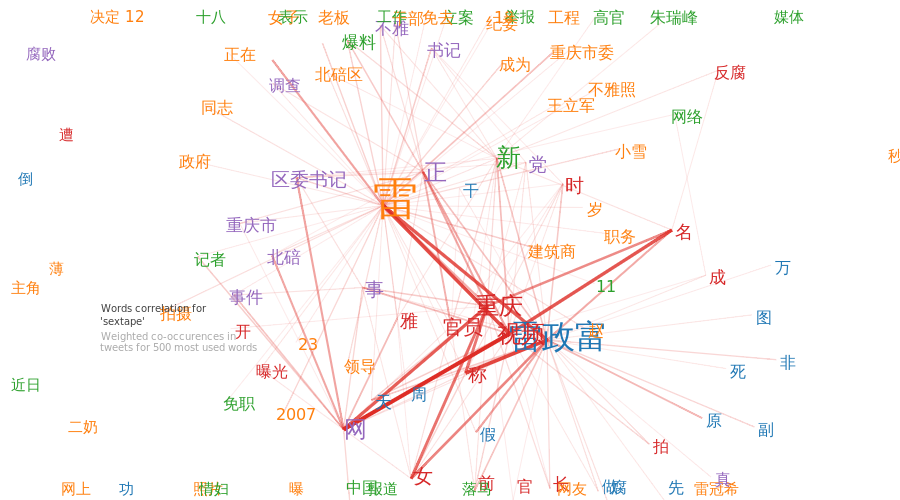
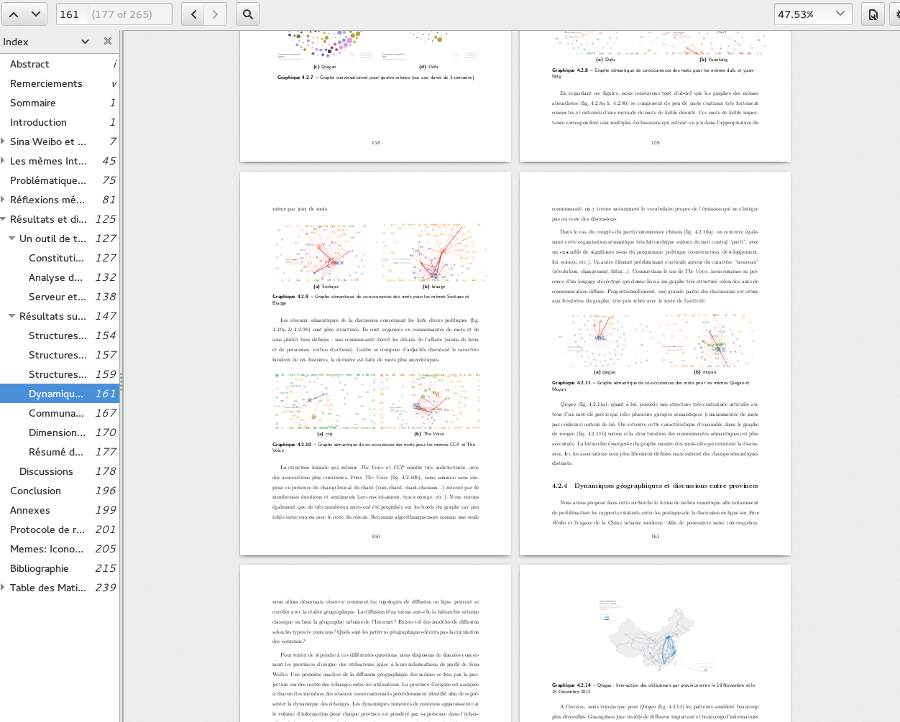
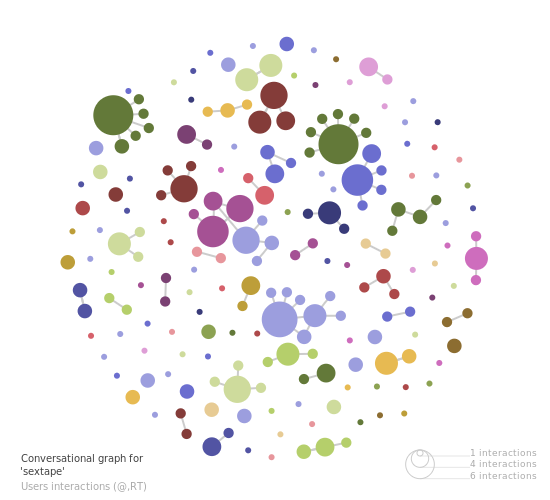

Topogram is an open-source web toolkit to map social, semantic and spatio-temporal dynamics. It answers the growing need for interactive mapping of complex online and offline interactions.

The software is divided into 2 parts:

1. a Python mining library and webserver to extract networks of words, citations and places from text data and
2. a collaborative visualization interface to edit, annotate and publish graphs.

For more details, read the [FAQ](http://topogram.io/faq) on the [official website](http://topogram.io).
The code is available on [Github](http://github.com/topogram/topogram).

