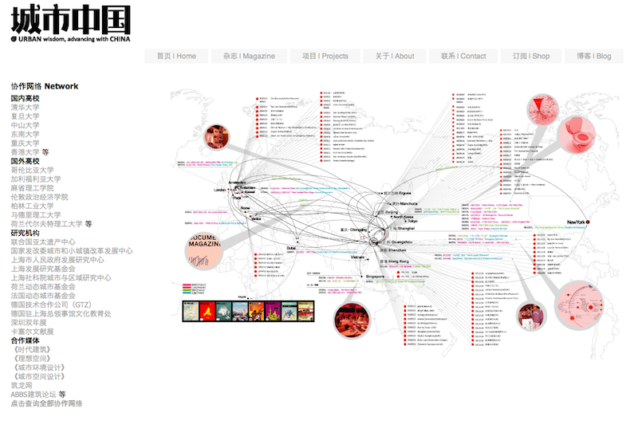
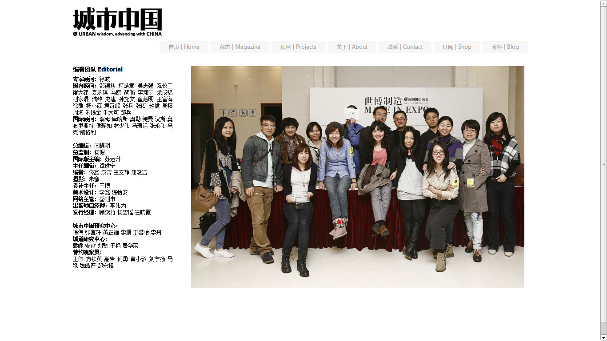

*Urban China* is a Chinese-language magazine that appears about ten times a year, with background articles on developments in the field of social geography, architecture and urban planning in China. Through various social media, Urban China offers a platform for exchanging ideas and experiences.

Clément Renaud was in charge was hired to help develop a new strategy for the magazine and to grow its influence online.

