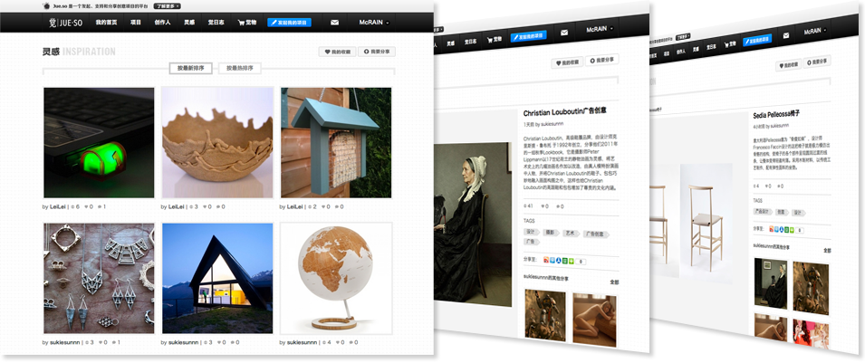
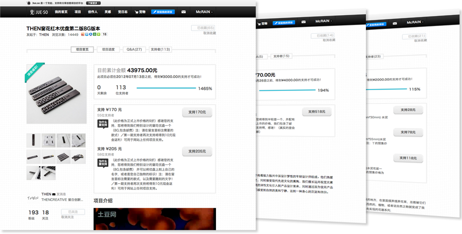
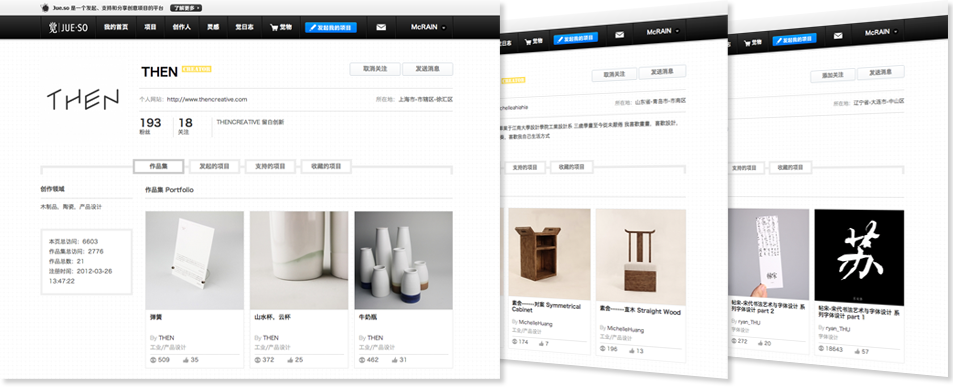
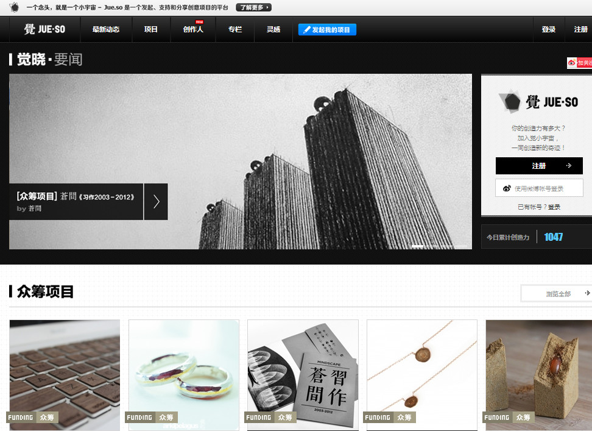
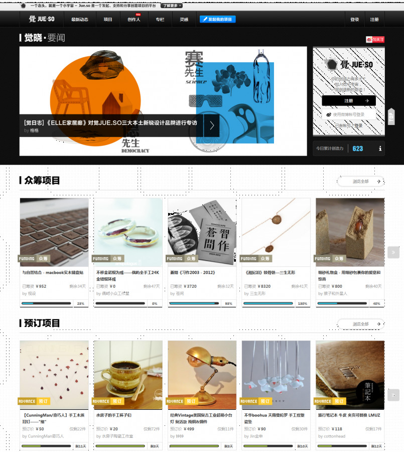
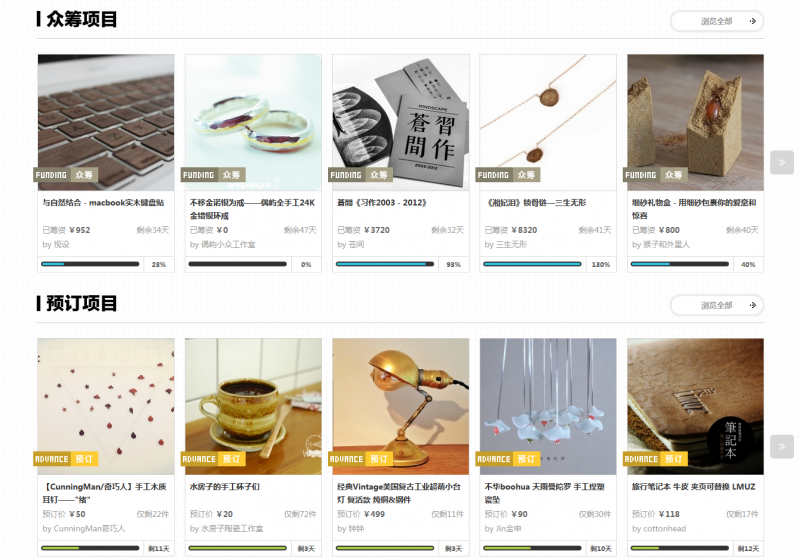

[Jue.so](http://jue.so) is Chinese first crowdfundig platform for creatives in China (artists, filmmakers, designers...). The Jue project is based also on a local community in China with residence space for artists and facilities for designers to produce their objects and ideas.

[Website](http://jue.so) / [Code on Github](https://github.com/clemsos/jueso)

