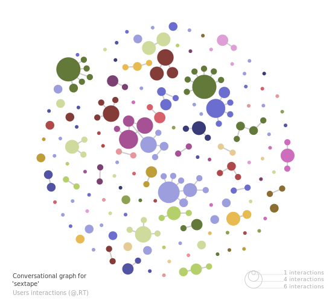
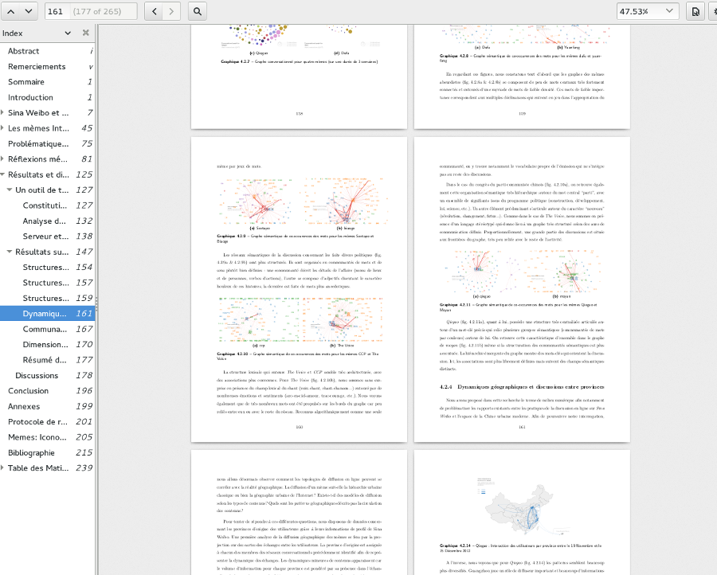

## **Design of a Internet memes data visualisation toolkit   <small>The case of the Chinese social network Sina Weibo</small>**

**Abstract :**

We develop a data mining and visualisation toolkit to study how the information is shared on online social network services. This software allows to observe relationships between conversational, semantical, temporal and geographical dimensions of online communication acts.

Internet memes are short messages that spread quickly through the Web. Following models that remain largely unknown, they articulate personal discussions, societal debates and large communication campaign. We analyse a set of Internet memes by using methods from social network analysis and Chinese natural language processing on a large corpus of 200 million tweets which represents/reflects the overall activity on the Chinese social network Sina Weibo in 2012. An interactive visualisation interface showing networks of words, user exchanges and their projections on geographical maps provides a detailed understanding of actual and textual aspects of each meme spread.

An analysis of hashtags in the corpus shows that the main content from Sina Weibo is largely similar to the ones in traditional media (advertisement, entertainment, etc.) Therefore, we decided to not consider hashtags as memes representatives, being mostly byproducts of well-planned strategic or marketingcampaigns. Our final approach studies a dozen of memes selected for the diversity of their topic: humor, political scandal, breaking news and marketing.

Defended on 2014 October, 8 in ParisTech Telecom. Paris, France.

* [Download the PDF](./thesis.pdf) (in French)
* [Thesis source code in Latex](https://github.com/clemsos/thesis)
* [Code on Github](https://github.com/clemsos/mitras)
* [Data on Weiboscope](http://weiboscope.jmsc.hku.hk/datazip/)

Below : Examples of meme visualizations (from the thesis)

Read [the complete thesis (in French)](./thesis.pdf)
