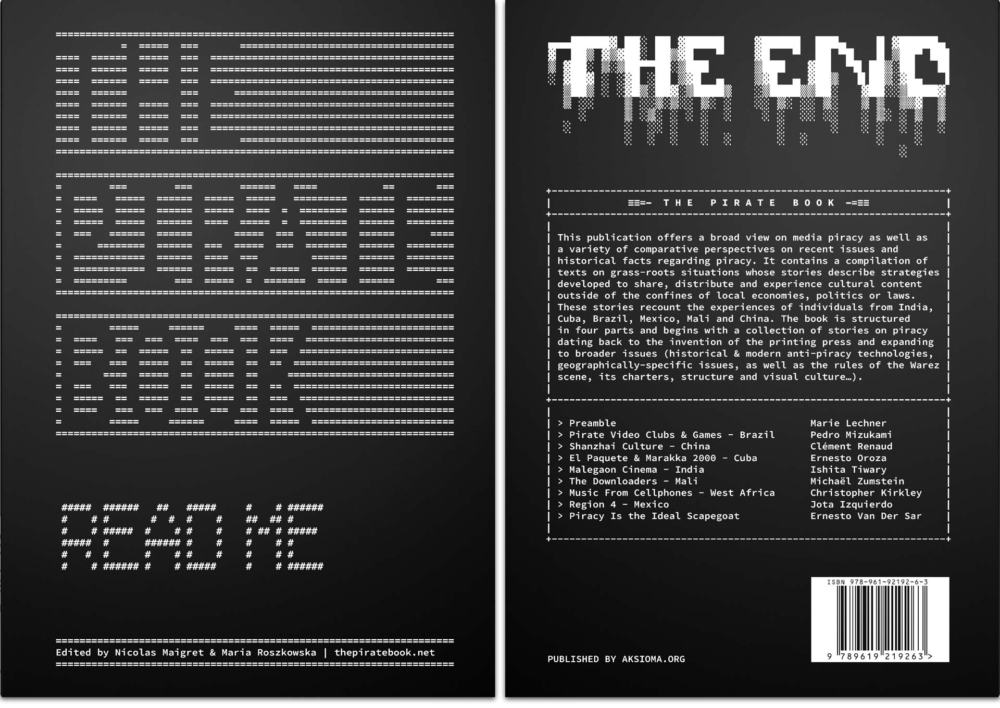
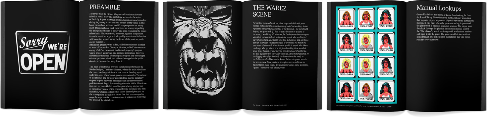
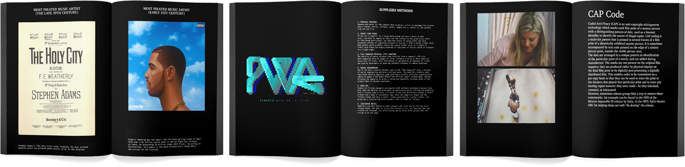

This work offers a broad view on media piracy as well as a variety of comparative perspectives on recent issues and historical facts regarding piracy. It contains a compilation of texts relating grassroot situations where strategies have been developed to share, distribute and experience cultural content outside of the confines of local economies, politics or laws. These stories recount the experiences of individuals from India, Cuba, Brazil, Mexico, Mali, China and UK.

The book is structured in four parts and begins with a collection of stories on piracy dating back to the invention of the printing press and expanding to broader issues: historical and modern antipiracy technologies, geographically specific issues, as well as the rules of the Warez scene, its charters, structure and visual culture.

CONCEPTION & EDITING: DISNOVATION.ORG
PUBLISHER: AKSIOMA, LJUBLJANA | 2015
CONTRIBUTORS: JOTA IZQUIERDO, CHRISTOPHER KIRKLEY, MARIE LECHNER, PEDRO MIZUKAMI, ERNESTO OROZA, CLÉMENT RENAUD, ISHITA TIWARY, ERNESTO VAN DER SAR & MICHAËL ZUMSTEIN

Read the interview by [Regine Debatty](http://we-make-money-not-art.com/the-pirate-book/) or the [Chapter about Shanzhai by Clément Renaud](http://thepiratebook.net/shanzhai).
