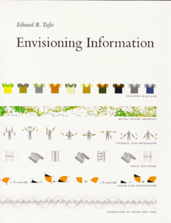

Blois, 1er Février 2016 , [Facebook Event](https://www.facebook.com/events/1706740366237284/)

---
class: center, middle, inverse

### Codes, réseaux, et photos de chats...
# Quel avenir pour les écritures visuelles ?

[Clément Renaud](http://clementrenaud.com)

Blois, 1er Février 2016

---
name:about
class: center, middle, inverse

**Clément Renaud** est chercheur, développeur et journaliste.

Travaillant entre Lyon et Shanghai, il s'est spécialisé dans la visualisation de données et s'intéresse aux formes expérimentales de l'écriture numérique.

---
name:confucius
class: center, middle, inverse

###  Zi Lu dit : *"Si le souverain de Wei vous invitait et vous confiait le gouvernement, que feriez vous en premier lieu"*
### Le Maître dit : *"Rectifier les noms ! Pour sûr !"*

.footnote[*Lunyu, les Entretiens de Confucius*, 13.3,   .small[trad. *Pierre Ryckmans*, Gallimard, 1987.]]
---
name:cuneiform
class:inverse, middle, center
background-image: url(cuneiform.jpg)

# Ecritures

.small.footnote[ Vente Maison Et Esclave Mâle, Collection Mésopotamie Iran.
 Musée du Louvre - photo: [(c) Claude Valette](https://www.flickr.com/photos/cvalette/9632530128) ]

---
name:library
class:inverse, middle, center
background-image: url(bibli.jpg)

# Ecritures

.small.footnote[Library in Trinity College, Dublin. Ireland - source:[(c) Ahmet Ertug](http://www.phillips.com/detail/AHMET-ERTUG/NY040114/225)]
---
name:data
class: inverse, center, middle
background-image: url(google-datacenter.jpg)

# Ecritures

.small.footnote[Data Center in Douglas County, Georgia. USA - source: [Google](http://www.google.com/about/datacenters/)]

---
name:data
class: inverse, center, middle
background-image: url(a-silicon-wafer-in-sand-maybe.jpg)

# Ecritures

.small.footnote[ photo: [ExtremeTech](http://www.extremetech.com/computing/178529-this-is-what-the-death-of-moores-law-looks-like-euv-paused-indefinitely-450mm-wafers-halted-and-no-path-beyond-14nm) - Lire : [How to Make a CPU: From Sand to Shelf](http://www.bit-tech.net/hardware/cpus/2010/06/10/how-to-make-a-cpu-from-sand-to-shelf/1)]

---
name:ecritures
class: center, middle, inverse

# 2. Lectures

---
name:nyancat
class: center, middle, inverse

<iframe width="640" height="480" src="https://www.youtube.com/embed/QH2-TGUlwu4?rel=0&amp;controls=0&amp;showinfo=0" frameborder="0" allowfullscreen></iframe>

.small[The [Nyan Cat](http://www.nyan.cat/) - source: [Youtube](https://www.youtube.com/watch?v=QH2-TGUlwu4)]
---
class:  center, inverse

# Economie de l'attention

.small[[Voir la vidéo](http://www.bilibili.com/video/av2023391/)]

---
class: center, middle

.footnote.small[source : [Competition among memes in a world with limited attention](http://www.nature.com/articles/srep00335), *Nature*, 2012]

---
name:textes
class: center, middle, inverse

# 3. Textes

---
name:intertextualite
class: inverse, center

# Intertextualité

---
name:digitalfolklore
class: inverse

.left-column[
# Digital Folklore

Lialina & Espenschied, 2009

  .footnote.small[source :[I can has history](http://nm.merz-akademie.de/~helene.dams/icanhashistory/)]
]

.right-column[
  <iframe style="width:100%;height:90vh;border:none;float:middle" src="http://nm.merz-akademie.de/~helene.dams/icanhashistory/"></iframe>
]

---
name:representation
class: center
background-image:url(perspective.png)

# Espace commun de représentation

.small.footnote[Jan Vredeman de Vries – *Traité « Perspective »* (1604)    source: [Denis Favennec](http://math.univ-lyon1.fr/irem/spip.php?article232) ]

---
name:visualisation
class: inverse, center, middle

# 4. Images

---
name:napoleon
class: inverse, center, middle

# Visualiser

.small[*La Carte figurative des pertes successives en hommes de l’Armée française dans la campagne de Russie en 1812-1813*   Joseph Minard, 1869. - source: [Wikipedia](https://fr.wikipedia.org/wiki/Charles_Joseph_Minard#/media/File:Minard.png)]

---
name:construire
class: center, middle

# Contruire des représentations

.left-column[
  
  *La Sémiologie Graphique*, Bertin (1967)

  
  *Envisioning Information*, Tufte (1990)
]
.right-column[
  
]

---
name:nicolasMaigret
class: center, middle, inverse

# Donner à voir

<iframe src="https://player.vimeo.com/video/36626555?byline=0&portrait=0" width="700" height="393" frameborder="0" webkitallowfullscreen mozallowfullscreen allowfullscreen></iframe>

System Introspection par [Nicolas Maigret](http://peripheriques.free.fr/blog/index.php?/works/2010-system-introspection/)

---
name:networkeffect
class: inverse, center, middle

# Comprendre le temps

*"From your IP address, we see you live in France, where the average life expectancy is 81.5 years — so after 8.15 minutes (8:09), your access will be blocked for a day, so you can get back to your life."*

<iframe width="640" height="360" src="https://www.youtube.com/embed/2LsLmcWP6-M?rel=0&amp;showinfo=0" frameborder="0" allowfullscreen></iframe>

.small[[Network Effect](http://networkeffect.io/) by Jonathan Harris]

---
name:final
class: center, middle, inverse

### En Conclusion
# Le "code" et les écritures visuelles

Quelques recommandations aux designers

---
name:thanks
class: center, middle, inverse

# Merci de votre attention !

### Clément Renaud
[http://clementrenaud.com](http://clementrenaud.com)
 
[@clemsos](http://twitter.com/clemsos)

