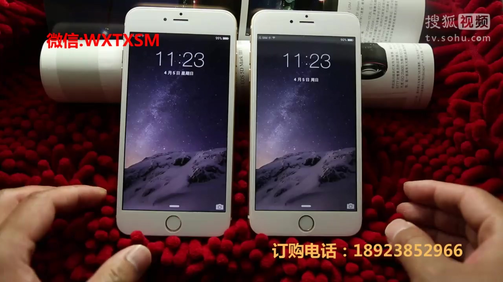
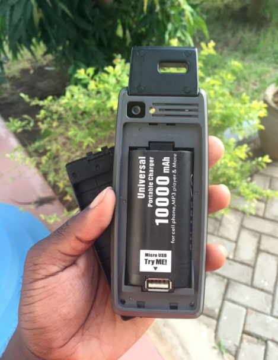
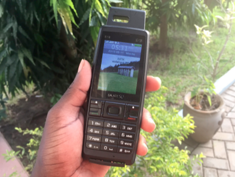
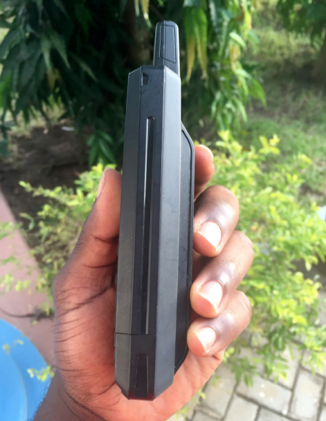
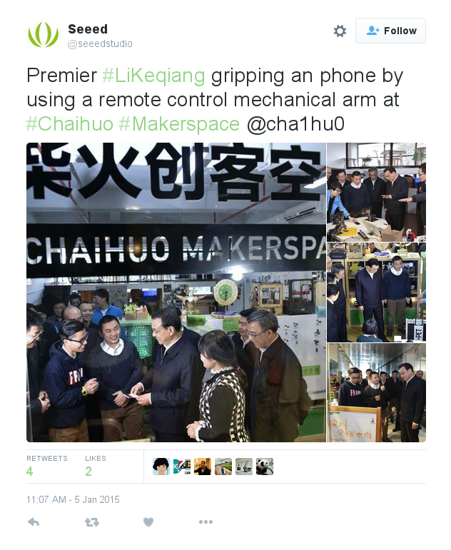

---
class: center, middle, inverse

# Bandits brought technology to this world
###  The Pirate Book
Transmediale, Berlin, Feb 2016

???
IC11 conference (intangile assets)

OECD presentation about estimating the costs of Piracy

“the model struggles with (...) a single market outside of Europe : China.”[ ibid.]

2.5 millions of jobs will be lost in 2015

[ “Counterfeiting and piracy may cost G20 governments over $120 billion every year” in RAND Europe. (2013). Measuring IPR infringements in the internal market. Cambridge, UK. ]

---
class: inverse
background-image: url(Pearl_River_Delta_Area.png)

.footnote[Pearl River Delta]

---
class: inverse
background-image: url(HQBstuff.jpg)

.footnote[Huaqiang Bei district]

---
background-image:
class: center, middle, inverse

### shan zhai
# 山寨

---
class: center, middle, inverse

## AAA货

---
class: inverse

.right-column[
  
]

.left-column[
  ## The PowerBank
  .footnote[The Power Bank Phone]
  
  
]

---
class: inverse
background-image: url(ShenzhenMap.png)

---
class: center, inverse, middle
background-image: url(HQBlife.jpg)

---
class: center, middle, inverse
background-image: url(Electronics_factory_in_Shenzhen-min.jpg)

---
class: inverse

.left-column[
  # Global politics of making
]
.right-column[
  
]
 

